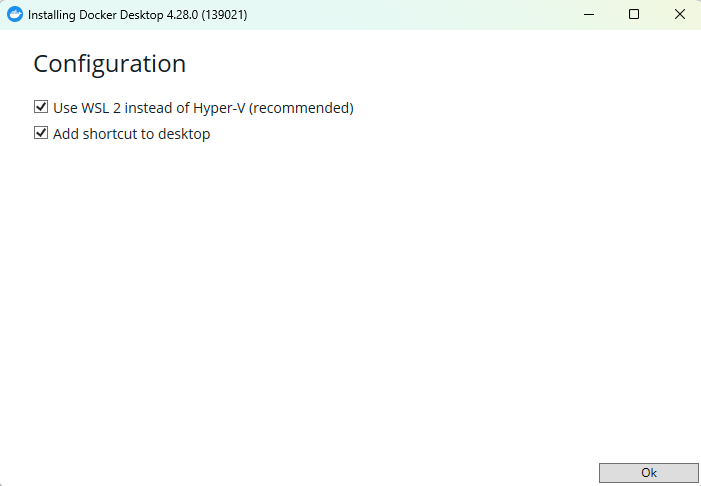
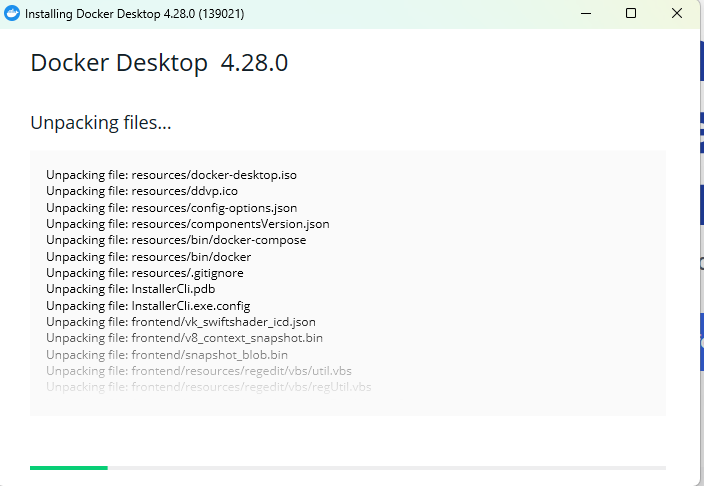
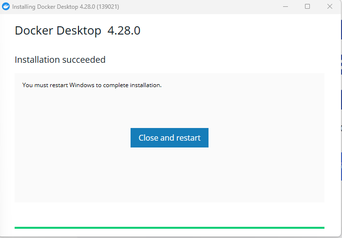

# Pending Header

To download Docker Desktop, head directly to [Docker Desktop](https://www.docker.com/products/docker-desktop/). Or you can directly download the installer depending on your OS:

- [Windows](https://desktop.docker.com/win/main/amd64/Docker%20Desktop%20Installer.exe?utm_source=docker&utm_medium=webreferral&utm_campaign=dd-smartbutton&utm_location=module&_gl=1*kb2hvt*_ga*MTMxMjU1NDEwMS4xNzEyNjk3NDQ4*_ga_XJWPQMJYHQ*MTcxMjY5NzQ0Ny4xLjEuMTcxMjY5ODgxNy42MC4wLjA.)
- [Mac (Intel Chip)](https://desktop.docker.com/win/main/amd64/Docker%20Desktop%20Installer.exe?utm_source=docker&utm_medium=webreferral&utm_campaign=dd-smartbutton&utm_location=module&_gl=1*kb2hvt*_ga*MTMxMjU1NDEwMS4xNzEyNjk3NDQ4*_ga_XJWPQMJYHQ*MTcxMjY5NzQ0Ny4xLjEuMTcxMjY5ODgxNy42MC4wLjA.)
- [Mac (Apple Chip)](https://desktop.docker.com/mac/main/arm64/Docker.dmg?utm_source=docker&utm_medium=webreferral&utm_campaign=dd-smartbutton&utm_location=module&_gl=1*kb2hvt*_ga*MTMxMjU1NDEwMS4xNzEyNjk3NDQ4*_ga_XJWPQMJYHQ*MTcxMjY5NzQ0Ny4xLjEuMTcxMjY5ODgxNy42MC4wLjA.)

## Windows Installer

Execute the installer, and select the options it has, then click on 'Ok'

Wait while the files are unpackaged and installed.

 

Once its done, close and restart your computer.

